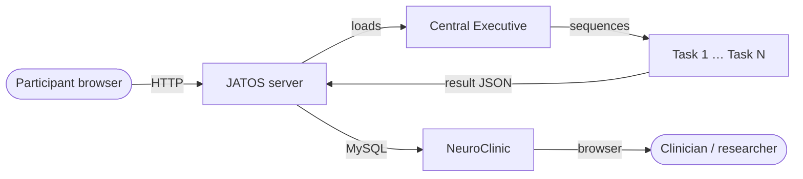

## What is the 3C Platform?

The **3C Platform** (NCMLabOnlineTools) is open-source software for delivering, scoring, and reviewing behavioural and cognitive assessments in a standard web browser. Built by Jason Steffener at the University of Ottawa, it combines validated questionnaires and cognitive tasks in a unified environment that works in-person, remotely, or completely offline — with no proprietary software and no specialist programming.

## Repositories

| Component | Repository |
|-----------|-----------|
| Front-end tasks & questionnaires | [NCMlab/NCMLabOnlineTools](https://github.com/NCMlab/NCMLabOnlineTools) |
| Back-end review portal (NeuroClinic) | [NCMlab/NeuroClinicPublic](https://github.com/NCMlab/NeuroClinicPublic) |

## How a session works

The participant opens a URL. JATOS loads the **Central Executive**, which reads two URL parameters — `UsageType` and `Battery` — builds the ordered task list, and hands off to each task in turn. Every task scores its own responses and submits a result JSON to JATOS. When the battery is complete the participant is redirected to a thank-you page or an external URL.

## Administration modes at a glance

| Mode | Internet required | JATOS location | Typical use |
|------|:-----------------:|----------------|-------------|
| Remote server | Yes | Cloud / institutional server | Large-scale remote studies |
| Local laptop | No | Researcher's laptop | In-clinic, no network |
| Offline LAN | No (local only) | Raspberry Pi or NUC | Multi-device room studies |

---

!!! note "Citation"
    If you use the 3C Platform in your research, please cite the associated publication. Details are in the repository README at [github.com/NCMlab/NCMLabOnlineTools](https://github.com/NCMlab/NCMLabOnlineTools).
