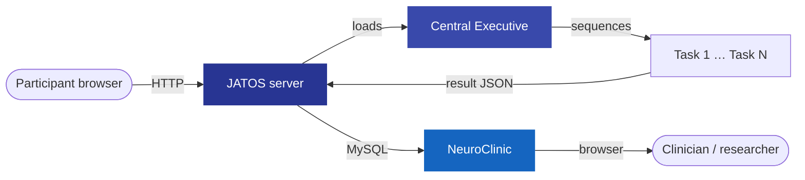

-   :fontawesome-solid-brain: **21 task components**

    ---

    Cognitive, memory, language, and questionnaire tasks — all pre-built and configurable without writing code.

    [:octicons-arrow-right-24: Browse all tasks](tasks/available-tasks.md)

-   :fontawesome-solid-language: **Multilingual**

    ---

    English, French, Japanese, and Korean via an on-screen language picker. Switch mid-session without reloading.

    [:octicons-arrow-right-24: Language support](features/languages.md)

-   :fontawesome-solid-wifi: **Three deployment modes**

    ---

    Remote server, local laptop (no internet), or offline LAN — same study files work in every setting.

    [:octicons-arrow-right-24: Administration modes](platform/administration.md)

-   :fontawesome-solid-microphone: **Rich response types**

    ---

    Keyboard, touchscreen, speech recognition, drawing (GIF-recorded), and visual analog scales.

    [:octicons-arrow-right-24: Response types](features/response-types.md)

-   :fontawesome-solid-check-double: **Automated scoring**

    ---

    Each task scores its own responses at completion — no post-collection extraction scripts needed.

    [:octicons-arrow-right-24: The Central Executive](platform/central-executive.md)

-   :fontawesome-solid-chart-line: **NeuroClinic portal**

    ---

    Review scores, replay drawing animations, and download data through the optional back-end web interface.

    [:octicons-arrow-right-24: Backend (NeuroClinic)](backend.md)

---

## What is the 3C Platform?

The **3C Platform** is open-source software for delivering, scoring, and reviewing behavioural and cognitive assessments in any modern web browser. Built by Jason Steffener at the University of Ottawa, it combines validated questionnaires and cognitive tasks in a unified environment that works in-person, remotely, or completely offline — with no proprietary software and no specialist programming.

The platform is built around two guiding principles:

- **Democratise access** — make validated cognitive and behavioural assessments freely available to researchers, clinicians, and educators regardless of institutional resources or technical expertise.
- **Leverage computing** — use browser technology to deliver richer assessments than paper-and-pencil allows, including timed responses, spoken stimuli, drawing tasks, speech recognition, and automated scoring.

---

## How a session works

The participant opens a URL containing two parameters: `UsageType` and `Battery`. JATOS loads the **Central Executive**, which reads those parameters, builds the ordered task list, and hands off to each task in turn. Every task scores its own responses and submits a result JSON to JATOS. When the battery is complete the participant is redirected to a thank-you page or an external URL.

---

## Administration modes

| Mode | Internet required | JATOS location | Typical use |
|------|:-----------------:|----------------|-------------|
| **Remote server** | Yes | Cloud or institutional server | Large-scale remote studies |
| **Local laptop** | No | Researcher's laptop | In-clinic, no network |
| **Offline LAN** | No (local only) | Raspberry Pi or mini PC | Multi-device room studies |

---

## Repositories

| Component | Repository |
|-----------|-----------|
| Front-end tasks & questionnaires | [NCMlab/NCMLabOnlineTools](https://github.com/NCMlab/NCMLabOnlineTools) |
| Back-end review portal (NeuroClinic) | [NCMlab/NeuroClinicPublic](https://github.com/NCMlab/NeuroClinicPublic) |

---

!!! note "Citation"
    If you use the 3C Platform in your research, please cite the associated publication. Details are in the repository README at [github.com/NCMlab/NCMLabOnlineTools](https://github.com/NCMlab/NCMLabOnlineTools).
