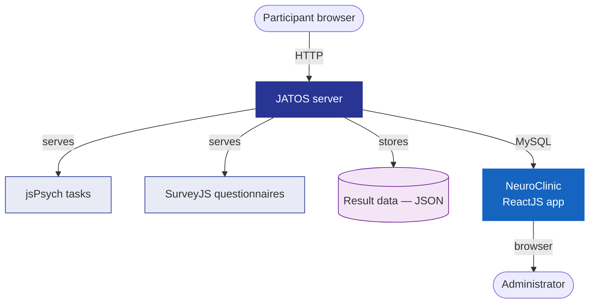
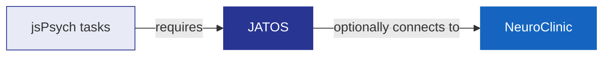

# Platform Overview

The 3C Platform is a layered system built from several open-source components. Understanding how they fit together will help you configure studies, troubleshoot issues, and extend the platform.

---

## The two interfaces

The platform has two distinct interfaces that serve different users:

**Front-end** — what study participants interact with. It is a collection of browser-based tasks and questionnaires, served by JATOS and built with jsPsych and SurveyJS. Participants open a URL on any modern browser (desktop, laptop, tablet, or phone) and complete the tasks assigned to their session.

**Back-end (NeuroClinic)** — what study administrators and clinicians use to review results. It is a separate ReactJS web application that connects to JATOS through a MySQL database. It provides per-participant result pages, scoring correction tools, drawing animations, and study management features.

The NeuroClinic is optional. The front-end works fully without it; JATOS stores all result data regardless of whether the NeuroClinic is installed.

---

## Component relationships

| Component | Role | Technology |
|-----------|------|-----------|
| **JATOS** | Experiment server — manages workers, sessions, result storage, and study delivery | Java |
| **jsPsych** | Cognitive task framework — handles trial sequencing, timing, and response collection | JavaScript |
| **SurveyJS** | Questionnaire framework — renders complex survey forms with branching logic | JavaScript |
| **Central Executive** | Orchestrator — reads URL parameters and controls which tasks run in what order | JavaScript (jsPsych plugin) |
| **NeuroClinic** | Result review portal — connects to JATOS MySQL database | ReactJS |

---

## How a session flows

1. A participant opens a study URL containing two parameters: `UsageType` and `Battery`.
2. JATOS loads the **Central Executive** — the first component in every study.
3. The Central Executive reads the URL parameters, looks up the battery definition in `Batteries.js`, and builds the ordered task list.
4. For each task in the list, JATOS loads the corresponding component. The task reads its configuration and instruction files, runs the trials, scores the responses, and submits the result JSON to JATOS.
5. The Central Executive then loads the next task, repeating until the battery is complete.
6. At the end of the battery, the participant is redirected to a thank-you page or an external URL.

---

## Core dependency chain

The platform has a clear dependency hierarchy:

You can run jsPsych tasks without JATOS (they work as standalone HTML files), but you lose session management, result storage, and multi-component orchestration. You can run JATOS without the NeuroClinic, but you lose the review portal. The NeuroClinic cannot function without JATOS and MySQL.

---

## Data flow

All result data is stored in JATOS as JSON. Each component submits its own result JSON when it completes. The Central Executive also stores lightweight session metadata (current task index, language preference) to support interruption recovery.

See [The Central Executive](central-executive.md) for details on session and batch data management, and [Backend (NeuroClinic)](../backend.md) for how results are reviewed after collection.
