# Available Tasks

The 3C Platform includes 21 task components covering cognitive assessment, memory, language, and questionnaires. Each component can be configured with different parameter sets to produce distinct versions of the task.

---

## Cognitive Tasks

### Stroop

Presents colour names written in coloured ink. Variants test colour naming, word reading, and the interference condition.

  <figure>
    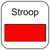
    <figcaption>Color</figcaption>
  </figure>
  <figure>
    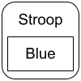
    <figcaption>Word</figcaption>
  </figure>
  <figure>
    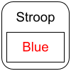
    <figcaption>Color / Word</figcaption>
  </figure>

**Parameter variants:**

- Color — name the ink colour
- Word — read the word
- Color/Word — name the ink colour when it conflicts with the word (interference condition)

---

### Trail Making

A pen-and-paper analogue implemented on screen. Participants connect numbered or alphanumeric circles in sequence.

  <figure>
    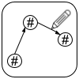
  </figure>

**Parameter variants:**

- Version A — connect numbers in ascending order
- Version B — alternate between numbers and letters (1-A-2-B…)
- Mirrored Version A
- Mirrored Version B

---

### Cancellation Task

Participants scan a page of characters and mark all occurrences of a target.

  <figure>
    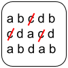
  </figure>

**Parameter variants:**

- Letter cancellation — mark every instance of a specified letter among distractors

---

### Matrix Reasoning

Participants select which image completes a visual pattern from a set of options.

  <figure>
    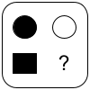
  </figure>

---

### Card Matching

Participants match cards based on a rule that changes without explicit instruction (Wisconsin Card Sorting Task analogue).

  <figure>
    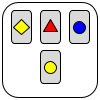
  </figure>

---

### Line Bisection

Participants mark the midpoint of a horizontal line. Assesses spatial neglect.

  <figure>
    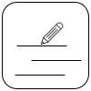
  </figure>

**Response variants:**

- Mouse click
- Touchscreen tap

---

### Delayed Match to Sample

A target is shown, then after a delay, participants select the matching item from an array.

  <figure>
    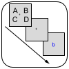
    <figcaption>Verbal</figcaption>
  </figure>
  <figure>
    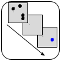
    <figcaption>Spatial</figcaption>
  </figure>

**Parameter variants:**

- Verbal — word stimuli
- Spatial — location or pattern stimuli
- Fixed difficulty
- Adaptive difficulty (single staircase)

---

### Image Matching

Participants are shown a target image and select the matching image from a set of options.

  <figure>
    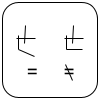
  </figure>

---

### Drawing Tasks

Participants produce drawings either by copying a presented image or following written instructions.

  <figure>
    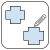
    <figcaption>Shape Copy</figcaption>
  </figure>
  <figure>
    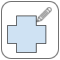
    <figcaption>Clock Drawing</figcaption>
  </figure>

**Features:**

- Sketchpad response (mouse, finger, or stylus)
- Drawing is recorded as a GIF animation
- GIF is stored and viewable in the NeuroClinic

---

### Visual Analog Scales

Participants indicate their response on a continuous scale.

  <figure>
    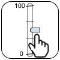
  </figure>

**Parameter variants:**

- Vertical scale
- Horizontal scale

---

## Memory Tasks

### Word Recall

Participants study a list of words and then attempt to recall as many as possible.

  <figure>
    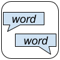
  </figure>

**Parameter variants:**

- Written stimuli / typed response
- Written stimuli / spoken response (speech recognition)
- Audio stimuli / typed response
- Audio stimuli / spoken response
- Administrator-recorded response (administrator marks correct/incorrect)

---

### Word Recognition

Participants are shown words one at a time and indicate whether each word appeared in an earlier study list.

  <figure>
    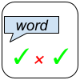
  </figure>

**Parameter variants:**

- Written stimuli
- Spoken stimuli (audio playback)

---

### Digit Span

Participants hear or see a sequence of digits and repeat them back.

  <figure>
    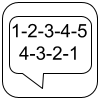
  </figure>

**Parameter variants:**

- Forward — repeat in the same order
- Backward — repeat in reverse order
- Written stimuli
- Spoken stimuli (audio playback)
- Fixed difficulty (set span length)
- Adaptive difficulty (staircase adjusts span length; see [Adaptive Difficulty](../features/adaptive-difficulty.md))

---

### Listening Accuracy

Participants listen to a spoken sentence or word and type or select what they heard.

  <figure>
    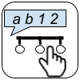
  </figure>

---

## Language Tasks

### Reading Test

Participants read words or sentences aloud. Responses are captured via speech recognition and reviewed by a human administrator.

  <figure>
    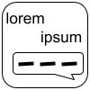
  </figure>

**Response type:** Spoken (speech recognition + audio recording)

---

### Fluency

Participants generate as many words as possible in a category within a time limit (semantic fluency) or beginning with a letter (phonemic fluency).

  <figure>
    
  </figure>

**Response type:** Spoken (speech recognition + audio recording)

---

## Questionnaires

### Questionnaires, Generic

Full SurveyJS questionnaire engine supporting a wide range of question types: rating scales, Likert scales, multiple choice, free text, matrix questions, and branching logic.

  <figure>
    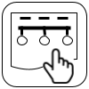
    <figcaption>Likert</figcaption>
  </figure>
  <figure>
    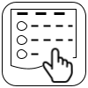
    <figcaption>Multiple choice</figcaption>
  </figure>
  <figure>
    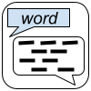
    <figcaption>Yes / No</figcaption>
  </figure>

**Parameter variants:** One entry per questionnaire instrument. Instruments are defined as SurveyJS JSON schemas in the configuration files.

---

### Questionnaires, Matrix

A grid-format questionnaire optimised for instruments where multiple items share the same response scale. Renders as a table with items as rows and response options as columns.

---

### Questionnaires, Form

A form-style questionnaire with individual items answered via pull-down menus or radio buttons.

---

### Questionnaire, Screening

An eligibility-checking questionnaire. Responses are evaluated against inclusion/exclusion criteria. Participants who do not meet criteria are directed to a screening-fail page; those who pass continue to the main battery.

  <figure>
    
  </figure>

---

### Consent Form

Presents study information and records the participant's informed consent. Consent is stored as part of the result data.

  <figure>
    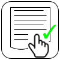
  </figure>

